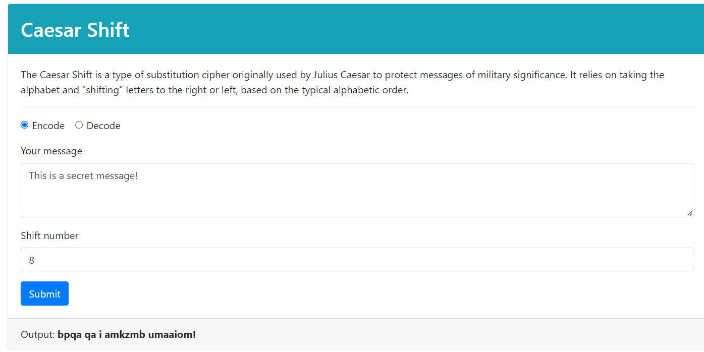

# Decoder Ring | Encryption/Decryption App

Decoder Ring is a live application that allows a user to utilize a Caesar Shift, Polybius Square, or Substitution Cipher in order to encode or decode secret messages.

## Links
[Live Vercel Client App](https://encryption-decryption-app.vercel.app/)  

## Technology
- JavaScript, HTML, Bootstrap, Mocha  
  


  
  
## Installation
1. Fork and clone this repository.
2. Run `npm install` to install project dependencies.
3. Run `npm start` to start the application.

## App Features
### Caesar Shift

The Caesar Shift is a type of substitution cipher originally used by Julius Caesar to protect messages of military significance. It relies on taking the alphabet and "shifting" letters to the right or left, based on the typical alphabetic order. For example, if you were to "shift" the alphabet to the left by 3, the letter "A" would become "X", the letter "E" would become "B", et cetera.  

  

When decoding the message, the number the original message was shifted by must be provided so the message can be shifted in the opposite direction.

#### App Screenshot

  

#### Logic of the caesar() function

The `caesar()` function in the `src/caesar.js` file has three parameters:

- _input_ is a string that refers to the inputted text to be encoded or decoded.
- _shift_ is an integer refers to how much each letter is "shifted" by. A positive number means shifting to the right (i.e. "A" becomes "D") whereas a negative number means shifting to the left (i.e. "M" becomes "K").
- _encode_ is a boolean that refers to whether the app will encode or decode the message. By default, it is set to `true` (encode).

The following constraints and rules are in place:

- If the _shift_ value is not present, equal to `0`, less than `-25`, or greater than `25`, the function returns `false` and produces an error message.
- Spaces in the message are maintained before and after encoding or decoding, as are other non-alphabetic symbols.
- Encoding is case-insensitive (e.g., both "a" or "A" are encoded to the same result).
- If a letter is shifted so that it goes "off" the alphabet (e.g. a shift of 3 on the letter "z"), it wraps around to the front of the alphabet (e.g. "z" becomes "c").

#### Examples

```js
caesar("thinkful", 3); //> 'wklqnixo'
caesar("thinkful", -3); //> 'qefkhcri'
caesar("wklqnixo", 3, false); //> 'thinkful'

caesar("This is a secret message!", 8); //> 'bpqa qa i amkzmb umaaiom!'
caesar("BPQA qa I amkzmb umaaiom!", 8, false); //> 'this is a secret message!'

caesar("thinkful"); //> false
caesar("thinkful", 99); //> false
caesar("thinkful", -26); //> false    
```

### Polybius Square

The Polybius Square is a cipher that is achieved by arranging a typical alphabet into a grid. Each letter is represented through a coordinate. Typically, it is possible to arrange the letters however you like and read off the coordinates in whatever direction you like.  

|       | **1** | **2** | **3** | **4** | **5** |
| ----- | ----- | ----- | ----- | ----- | ----- |
| **1** | A     | B     | C     | D     | E     |
| **2** | F     | G     | H     | I/J   | K     |
| **3** | L     | M     | N     | O     | P     |
| **4** | Q     | R     | S     | T     | U     |
| **5** | V     | W     | X     | Y     | Z     |


In this example, the grid will be arranged as above and coordinates will be read by comparing the first digit to the number on the top of the table and the second digit to that on the left. For example, in the above table, the letter "B" would be represented by the numerical pair "21".

When decoding the message, each pair of numbers is translated using the coordinates.

#### App Screenshot


#### Logic of the polybius() function

The `polybius()` function in the `src/polybius.js` file has two parameters:

- _input_ is a string that refers to the inputted text to be encoded or decoded.
- _encode_ is a boolean that refers to whether it will encode or decode the message. By default it is set to `true` (encode).

The following constraints and rules are in place:

- The function assumes that no additional symbols are included as part of the input. Only spaces and letters can be included.
- When encoding, the output will still be a string.
- When decoding, the number of characters in the string (excluding spaces) need to be even. Otherwise, it will return `false` and produce an error.
- Spaces in the message are maintained before and after encoding or decoding.
- Encoding is case-insensitive (e.g., both "a" or "A" are encoded to the same result).
- The letters "I" and "J" share a space. When encoding, both letters are converted to `42`, but when decoding, both letters are shown as `"(i/j)"`.

#### Examples

```js
polybius("thinkful"); //> "4432423352125413"
polybius("Hello world"); //> '3251131343 2543241341'

polybius("3251131343 2543241341", false); //> "hello world"
polybius("4432423352125413", false); //> "th(i/j)nkful
polybius("44324233521254134", false); //> false
```  

### Substitution Cipher

The Substitution Cipher requires a standard alphabet and a substitution alphabet. Letters from the standard alphabet will be transposed to the standard alphabet. This cipher requires that the recipient have the substitution alphabet. Otherwise, the recipient won't be able to decode the message.  

  

For example, in the image above, the word "HELLO" would be translated as follows:

- "H" becomes "R".
- "E" becomes "M".
- "L" becomes "W".
- "O" becomes "L".

This would result in the code "RMWWL". To decrypt this code, you would simply take the result and transpose back from the substitution alphabet to the standard alphabet.

#### App Screenshot


#### Logic of the substitution() function

The `substitution()` function in the `src/substitution.js` file has three parameters:

- _input_ is a string that refers to the inputted text to be encoded or decoded.
- _alphabet_ is a string that refers to substitution alphabet.
- _encode_ is a boolean that refers to whether it will encode or decode the message. By default, it is set to `true` (encode).

The following constraints and rules are in place:

- The function assumes that no additional symbols will be included as part of the input. Only spaces and letters can be included.
- Spaces in the message are maintained before and after encoding or decoding.
- Encoding/decoding is case-insensitive (e.g., both "a" or "A" are encoded to the same result).
- The _alphabet_ parameter must be a string of exactly 26 characters. Otherwise, the function will return `false` and produce an error.
- All of the characters in the _alphabet_ parameter must be unique. Otherwise, the function will return `false` and produce an error.

#### Examples

```js
substitution("thinkful", "xoyqmcgrukswaflnthdjpzibev"); //> 'jrufscpw'
substitution("You are an excellent spy", "xoyqmcgrukswaflnthdjpzibev"); //> 'elp xhm xf mbymwwmfj dne'
substitution("jrufscpw", "xoyqmcgrukswaflnthdjpzibev", false); //> 'thinkful'

substitution("thinkful", "short"); //> false
substitution("thinkful", "abcabcabcabcabcabcabcabcyz"); //> false
``` 
